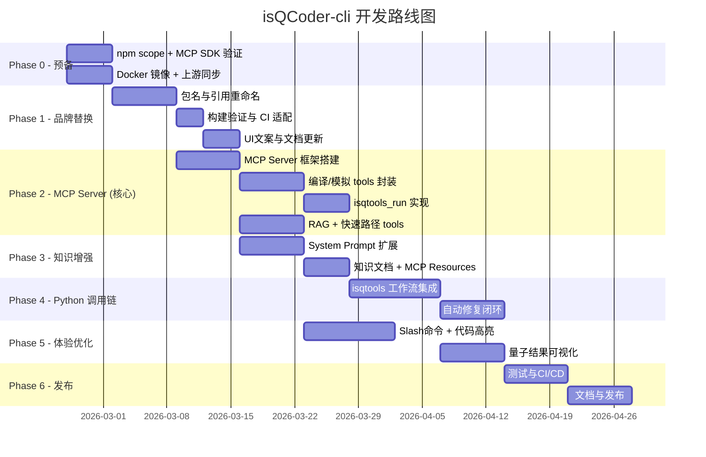

# isQCoder-cli 开发规划

> **版本:** v0.3-draft | **日期:** 2026-02-25 | **基线:** Gemini CLI
> v0.30.0-nightly.20260210 + isQCodeAgent

---

## 1. 项目概述

isQCoder-cli 是基于 Google Gemini CLI 开源项目的二次开发，旨在打造一款
**面向量子计算的终端 AI 编程助手**。它融合了已有的 **isQCodeAgent**
Python 多智能体系统的核心能力（编译反馈循环、RAG 知识检索、错误自修复、规则进化），通过 Gemini
CLI 提供交互式终端体验，最终实现 **用 Python
(isqtools) 调用 isQ 代码完成量子计算编程任务** 的完整工作流。

### 1.1 双项目融合架构

```
┌─────────────────────────────────────────────────────────────┐
│                    isQCoder-cli (TypeScript)                 │
│            Terminal UI · LLM 编排 · 通用工具集               │
│                   基于 Gemini CLI fork                       │
├─────────────────────────────────────────────────────────────┤
│                     Bridge Layer (MCP)                       │
│         TypeScript ←→ Python 跨语言调用桥梁                  │
├─────────────────────────────────────────────────────────────┤
│                isQCodeAgent (Python)                         │
│  多智能体编排 · 编译反馈循环 · RAG · 规则进化 · Docker 沙箱  │
│              已有成熟实现，作为后端服务集成                    │
└─────────────────────────────────────────────────────────────┘
```

### 1.2 技术架构

```
isQCoder-cli (Monorepo / npm workspaces)
├── packages/cli          # 前端 UI (React + Ink)
├── packages/core         # 后端逻辑 (API 编排、工具执行、提示词构建)
│   └── src/tools/        # 内置工具 (file, shell, grep, web-fetch, MCP...)
├── packages/sdk          # 编程式 SDK (部分实现)
├── packages/a2a-server   # Agent-to-Agent 服务器 (实验性)
├── packages/test-utils   # 测试工具
└── packages/vscode-ide-companion  # VS Code 扩展

isQCodeAgent (独立 Python 项目 — 作为 MCP Server 集成)
├── src/isq_agent/               # 主包
│   ├── multi_agent/             # 多智能体核心 (graph.py + 11 agents)
│   ├── rag/                     # RAG 检索系统
│   ├── execution/               # Docker 执行引擎
│   └── ...
├── src/llm/                     # 多提供商 LLM
└── src/execution/               # 顶层执行引擎
```

**核心技术栈:**

- **前端 CLI:** Node.js ≥20 · TypeScript · React/Ink · Vitest · esbuild
- **后端 Agent:** Python 3.10+ · LangGraph · LangChain · Qdrant · Docker

---

## 2. 开发目标

将 Gemini CLI + isQCodeAgent 融合为 **isQ 量子计算专属开发工具**：

1. **完成品牌体系替换** — 统一所有包名、命令名、UI 文案和文档
2. **集成 isQCodeAgent 为 MCP Server** — 将 Python 多智能体系统封装为 MCP 服务
3. **深度量子计算知识注入** — System Prompt 增强 + isQCodeAgent RAG 知识库
4. **isQ 编译反馈循环** — 复用 isQCodeAgent 的编译-修复-进化流水线
5. **isqtools Python 调用链** — 在 CLI 中无缝使用 Python 调用 isQ 代码
6. **上游同步机制** — 保持与 Gemini CLI 主线的可合并性

---

## 3. 分阶段开发计划与进度

> 每个阶段的详细开发文档见对应子文档链接。

| 阶段        | 名称                           | 预计工期 | 状态      | 详细文档                                         |
| ----------- | ------------------------------ | -------- | --------- | ------------------------------------------------ |
| **Phase 0** | 预备阶段                       | 1 周     | ✅ 已完成 | [phase0-preparation.md](./phase0-preparation.md) |
| **Phase 1** | 品牌体系完整替换               | 1–2 周   | ✅ 已完成 | [phase1-branding.md](./phase1-branding.md)       |
| **Phase 2** | isQCodeAgent → MCP Server 封装 | 2–3 周   | ✅ 已完成 | [phase2-mcp-server.md](./phase2-mcp-server.md)   |
| **Phase 3** | 量子计算知识增强               | 2–3 周   | ✅ 已完成 | [phase3-knowledge.md](./phase3-knowledge.md)     |
| **Phase 4** | isqtools Python 调用链         | 2–3 周   | ✅ 已完成 | [phase4-isqtools.md](./phase4-isqtools.md)       |
| **Phase 5** | 开发体验优化                   | 2–3 周   | ✅ 已完成 | [phase5-ux.md](./phase5-ux.md)                   |
| **Phase 6** | 质量保障与发布                 | 2 周     | ⬜ 未开始 | [phase6-release.md](./phase6-release.md)         |

**预计总工期:** 11–15 周（含 Phase 0 预备阶段）

**状态说明:** ⬜ 未开始 | 🟡 进行中 | ✅ 已完成 | ⏸️ 暂停

> [!NOTE] **开发环境**
>
> 统一在 **Linux 工作站**
> (`/home/alba/Project/isQCoder/`) 上完成所有开发、构建、测试和运行操作（TypeScript 构建 +
> Python 运行时 + Docker 沙箱）。

---

## 4. 时间线总览



---

## 5. 关键集成决策

### 5.1 为什么选择 MCP 而非直接子进程调用？

| 方案           | 优点                             | 缺点                                |
| -------------- | -------------------------------- | ----------------------------------- |
| **MCP Server** | 标准协议、热插拔、独立部署和更新 | 需要额外封装层                      |
| 子进程调用     | 实现简单                         | 耦合紧密、难以独立升级              |
| A2A Server     | 适合多 Agent 协作                | 过于复杂、Gemini CLI 对其支持实验性 |
| HTTP REST API  | 通用性强                         | 需要独立启动服务、端口管理          |

**结论:** MCP 是最佳选择 — Gemini
CLI 原生支持 MCP，isQCodeAgent 只需封装一层 MCP 接口即可无缝接入。

### 5.2 isQCodeAgent 改造清单

| 组件                   | 改造程度   | 说明                                 |
| ---------------------- | ---------- | ------------------------------------ |
| `multi_agent/graph.py` | 低         | 保持原有编排逻辑，通过 MCP tool 触发 |
| `multi_agent/agents/`  | 低         | 11 个 Agent 角色原封不动复用         |
| `rag/`                 | 低         | 暴露为 MCP resource/tool             |
| `execution/`           | 中         | 扩展支持 isqtools Python 执行        |
| `cli/`                 | 废弃       | CLI 层由 isQCoder-cli 替代           |
| **新增 `mcp_server/`** | **新开发** | MCP 协议封装层，约 500-800 LOC       |

### 5.3 LLM 调用分工

| 任务类型           | LLM 调用方            | 说明                                |
| ------------------ | --------------------- | ----------------------------------- |
| 对话理解、任务规划 | Gemini (via CLI)      | 利用 Gemini CLI 原有的 LLM 编排能力 |
| isQ 代码生成       | Gemini (via CLI)      | System Prompt 注入 isQ 语法规则     |
| 编译错误分析与修复 | isQCodeAgent 内部 LLM | Reviewer + Evolver Agent            |
| RAG 检索           | 无需 LLM              | 纯向量检索 + BM25                   |
| 快速路径           | 无需 LLM              | 模板匹配，0 LLM 调用                |

---

## 6. 上游同步策略

| 策略           | 详情                                                    |
| -------------- | ------------------------------------------------------- |
| **分支管理**   | 维护 `main` (isQCoder) 和 `upstream` 跟踪分支           |
| **合并频率**   | 每 2 周从上游 rebase/merge 一次                         |
| **冲突最小化** | 品牌修改集中在少数配置文件；新功能在独立文件/目录中实现 |
| **自动化**     | CI 中添加上游兼容性检查（定期 dry-run merge）           |
| **MCP 解耦**   | 量子能力全部通过 MCP Server 提供，不侵入上游核心代码    |

> [!IMPORTANT] 修改现有上游文件时，优先通过 **扩展/钩子机制**
> 而非直接修改源码，以减少合并冲突。

---

## 7. 风险与依赖

| 风险                         | 影响             | 缓解措施                                  |
| ---------------------------- | ---------------- | ----------------------------------------- |
| isQ 编译器 Docker 镜像不可用 | 无法编译/模拟    | 提前构建并发布镜像                        |
| MCP Python SDK 不成熟        | 集成困难         | Phase 0 验证；备选: subprocess + JSON-RPC |
| isQCodeAgent 依赖 Qdrant     | 部署复杂度增加   | Docker Compose；备选: FAISS               |
| 上游 Gemini CLI 大规模重构   | 合并冲突增加     | 保持高频同步、最小化侵入                  |
| Gemini API 不支持量子领域    | 代码生成质量不足 | System Prompt + RAG + 编译反馈循环        |
| npm @isqcoder scope 不可用   | 无法发布         | Phase 0 提前申请                          |
| Python/Node.js 双运行时      | 用户环境复杂     | 远程服务器统一部署 + `/qenv` 检测         |
| 品牌替换引入构建错误         | P1 耗时增加      | 分子阶段验证                              |
| isQCodeAgent 异步改造        | MCP 集成阻塞     | `asyncio.to_thread` 包装同步调用          |
